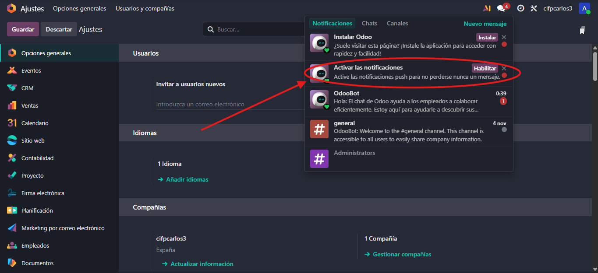
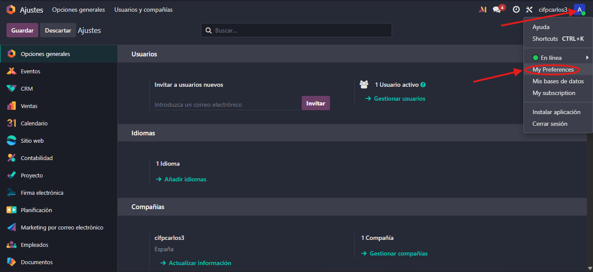
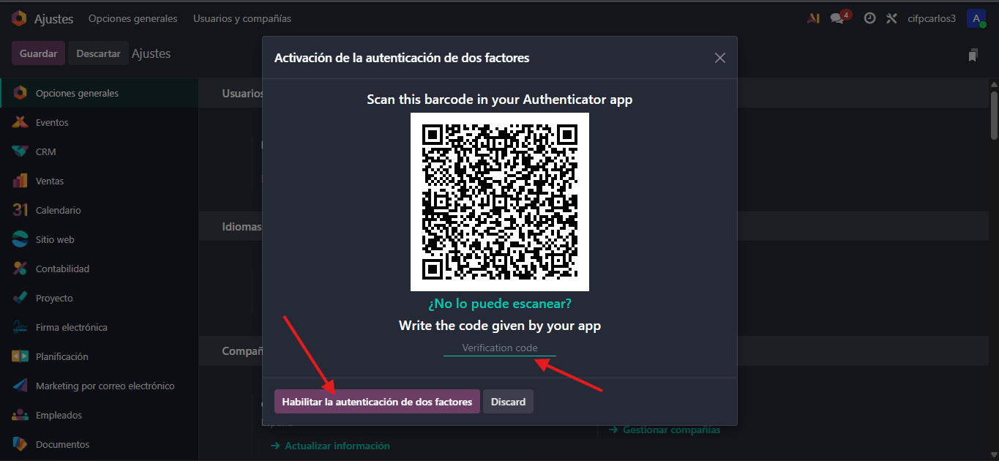
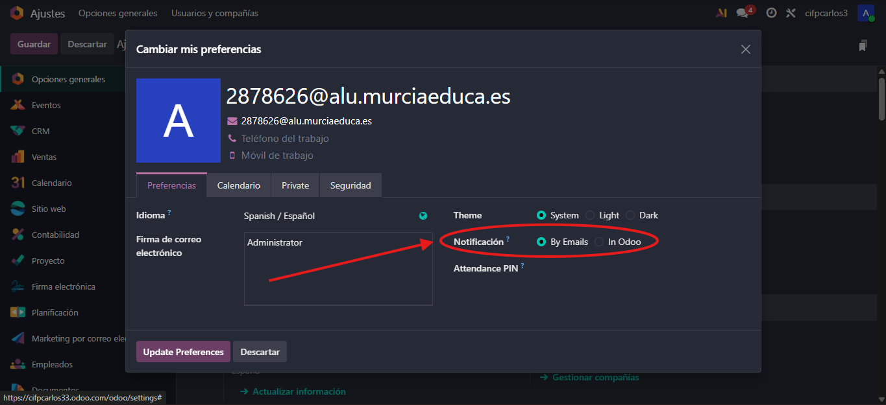
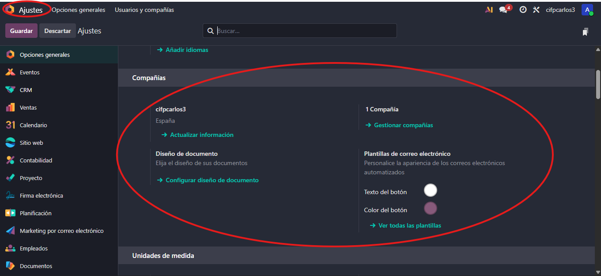
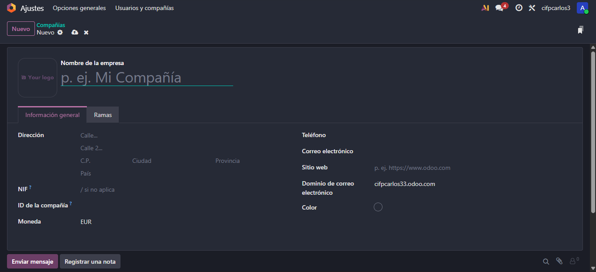
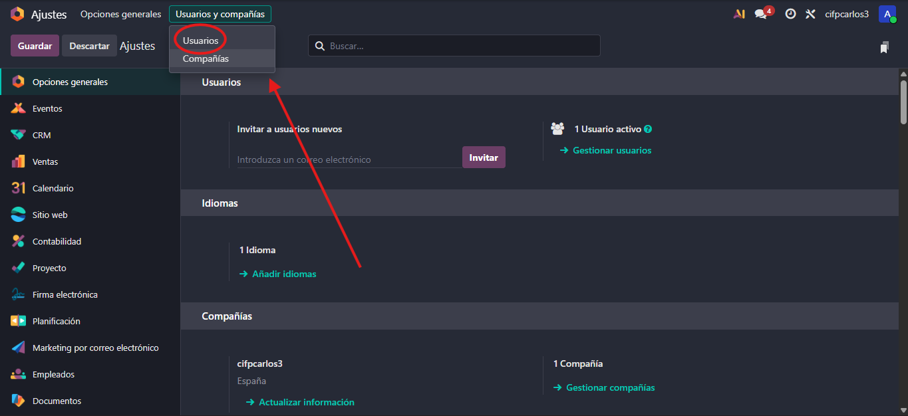
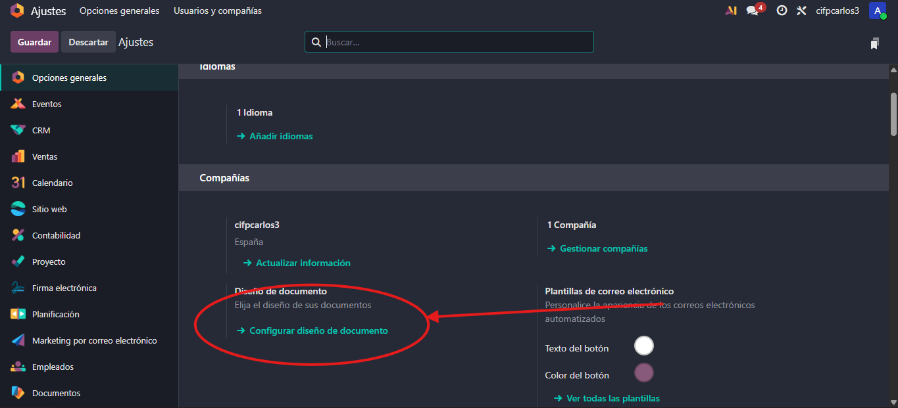
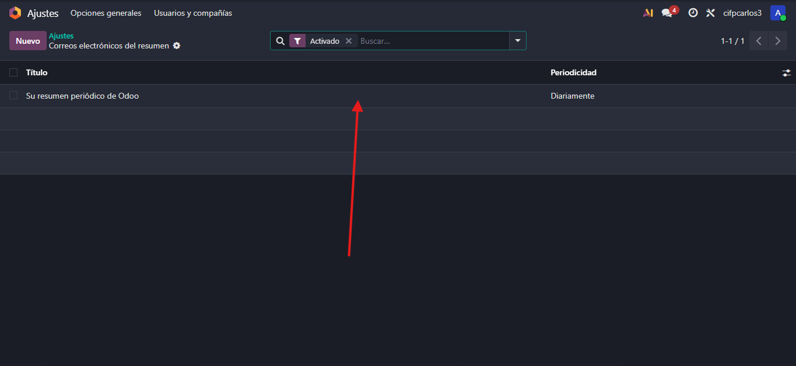
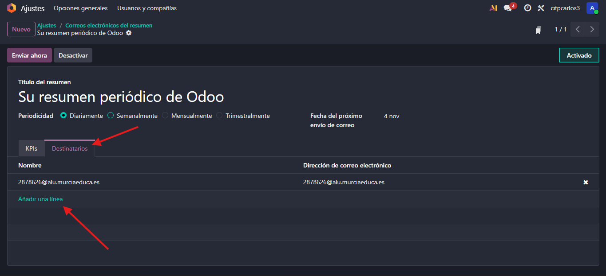

# 04 — Ajustes generales

**Objetivo:** Configurar las opciones generales de Odoo y personalizar el entorno para mejorar la usabilidad

## Introducción

La configuración general de Odoo se realiza en la sección **Ajustes**

## Activar Notificaciones

Es recomendable configurar las notificaciones para evitar perder información relevante

## Notificaciones en Odoo

- Odoo permite activar notificaciones internas que aparecen dentro de la aplicación
- Cuando ocurre algo importante (por ejemplo, una tarea asignada o un mensaje nuevo), un bot de Odoo puede notificar al usuario mediante el chat interno
- Las notificaciones se muestran en una pestaña similar a las redes sociales y desaparecen una vez leídas

## Perfil de Usuario

Accediendo al perfil del usuario (arriba a la derecha), es posible personalizar la experiencia, los datos visibles para otros empleados y las opciones de seguridad

### Modo Oscuro
Se puede activar o desactivar desde el menú del perfil

### Datos del Perfil
- Mantener actualizados los datos personales: nombre, puesto, teléfono, correo, etc  
- Esta información será visible para otros empleados en la base de datos

### Autenticación de Dos Factores (2FA)
- Es **altamente recomendable** activar el 2FA para proteger el acceso a Odoo  
- Compatible con aplicaciones como Google Authenticator  
- Mejora la seguridad en entornos con información sensible

### Notificaciones
- Por defecto, Odoo envía notificaciones por correo electrónico aunque se suele cambiar esta opción a “Gestionar en Odoo" para centralizar las alertas dentro de la app y evitar la sobrecarga diaria de correos

### Firma de Correo Electrónico
- Desde el perfil se puede editar el **pie de firma** usado en los correos enviados desde Odoo

## Usuarios y Compañías

La gestión de **usuarios** y **compañías** se realiza desde **Ajustes**

### Compañías
- Permite crear y administrar **múltiples empresas o bases de datos**  

- Es necesario registrar datos clave como:
  - Nombre y logo de la empresa  
  - Dirección fiscal  
  - CIF/NIF o número de identificación

### Usuarios y Roles
- Desde aquí se añaden nuevos usuarios y se definen sus **roles**  

- Los permisos se configuran **por módulo**:
  - En Ventas, un usuario puede tener rol de **“Usuario”** o **“Administrador”**  
  - En *Contabilidad*, puede tener **acceso básico** o ninguno
- En **Enterprise**, el coste se calcula **por usuario activo**  
- En **Community**, se pueden crear **usuarios ilimitados**

## Idiomas y Diseño de Documentos

### Idiomas
- Desde los ajustes se pueden **añadir idiomas adicionales**
- Cada usuario puede definir su **idioma preferido** desde su perfil

### Diseño de Documentos
- En esta sección se configura la apariencia de los documentos generados por Odoo
- Odoo puede detectar los colores del logo y aplicarlos automáticamente al diseño
- Se pueden elegir distintas plantillas de factura y modificar los elementos

## Emails de Resumen

Esta configuración controla los informes de resumen que Odoo envía automáticamente por correo

### Periodicidad y Contenido
- Por defecto, Odoo envía **resúmenes diarios** sobre la actividad del sistema  
- Se puede cambiar la periodicidad a **semanal o mensual**  
- Es posible **personalizar la información** que se desea recibir

### Destinatarios
- Se pueden enviar los resúmenes a **otros usuarios o departamentos** además del propio remitente.

## Resultado esperado

Tras configurar los ajustes generales, Odoo debe presentar un entorno optimizado con:

- Notificaciones activas y centralizadas
- Perfil y seguridad configurados  
- Usuarios y roles definidos 
- Documentos personalizados
- Emails de resumen adaptados a las necesidades del negocio
