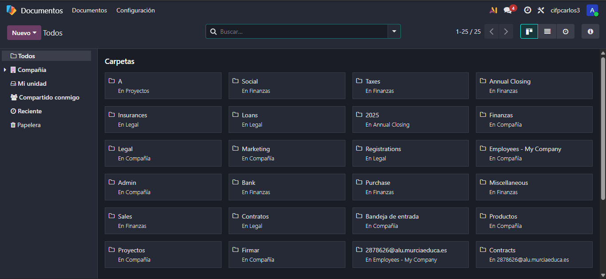
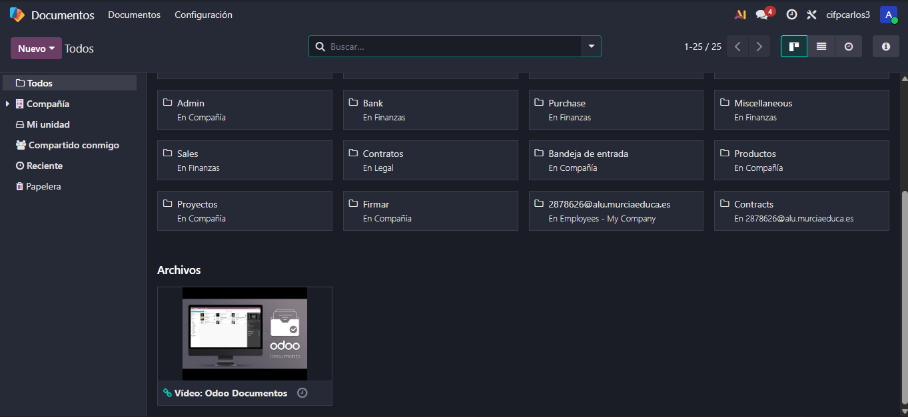
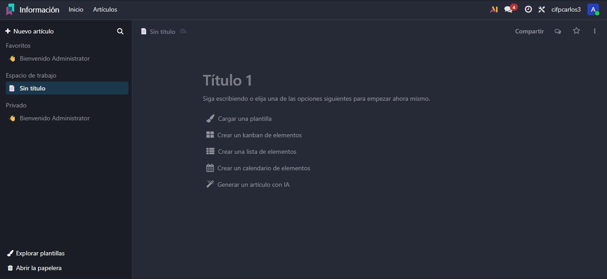
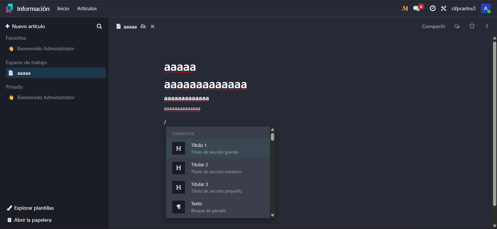
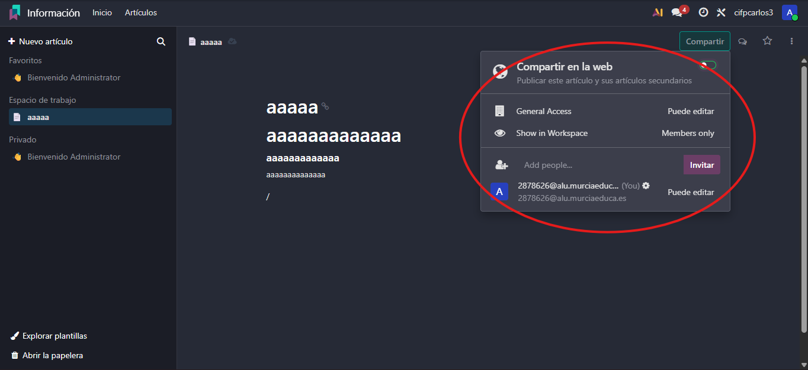

# 09 — Documentos, Firma e Información

El módulo de **Documentación (Documentos)**, el de **Firma Electrónica** y el de **Información** permite centralizar, gestionar y compartir documentos y conocimiento

## 1. Módulo Documentos

Este módulo actúa como un repositorio central para gestionar grandes volúmenes de documentación relacionada con otros módulos, como Recursos Humanos, CRM o Contabilidad

- **Repositorio Centralizado:** Permite a la empresa almacenar y organizar todos los documentos en un solo lugar

- **Integración con Proyectos:** Los proyectos creados en el módulo de Proyectos se vinculan automáticamente con Documentos, facilitando el acceso a archivos relacionados con tareas específicas
- **Edición Nativa:** Odoo integra hojas de cálculo colaborativas dentro del sistema.
  - Permite rastrear cambios y ediciones por usuario
  - Evita problemas de compatibilidad y la necesidad de descargar documentos localmente

  
- **Funcionalidades Avanzadas:** Se pueden manipular los documentos subidos, por ejemplo, dividiendo un PDF en varias partes y seleccionando qué se desea separar
- **Etiquetas y Flujo:** Las etiquetas permiten asignar funcionalidades a un documento, como generar una factura o requerir validación de otro departamento

## 2. Firma Electrónica

Este módulo permite digitalizar contratos y acuerdos, ofreciendo un flujo legal y administrativo completamente digital

- **Agilización y Centralización:** Facilita la gestión de contratos y elimina la necesidad de herramientas externas
- **Creación de Plantillas:** Se pueden arrastrar campos sobre el documento, incluyendo:
  - Firma
  - Nombre
  - Fecha
  - Casillas de verificación o texto adicional  
- **Envío y Gestión:** Los contratos pueden enviarse a clientes para firma digital
  - Recordatorios automáticos y certificados por página
  - Opciones de firma: automática, dibujada o cargada previamente 
- **Registro de Contratos Firmados:** Permite llevar un control de todos los documentos firmados y enviar copias al cliente

## 3. Módulo Información

El módulo de Información funciona como base de conocimiento interna y alternativa a herramientas como Notion o Coda
  
  
- **Propósito:** Centraliza todo el conocimiento de la empresa, como fichas técnicas, preguntas frecuentes y documentación 
- **Estructura Jerárquica:** Funciona por espacios de trabajo y permite anidar páginas para crear una estructura tipo Wikipedia
  - Se pueden crear índices vinculados a secciones anidadas 
- **Herramientas de Edición:** La barra (/) permite insertar listas, columnas, archivos, enlaces, videos o encuestas de valoración 
 
- **Seguridad y Permisos:** Se puede compartir en la web, copiar enlaces y configurar permisos y visibilidad
- **Historial de Versiones:** Permite restaurar versiones anteriores en caso de cambios incorrectos
- **Publicación:** Se puede vincular Knowledge con tareas de Proyectos, haciendo que la información fluya directamente a las tarjetas de trabajo
 