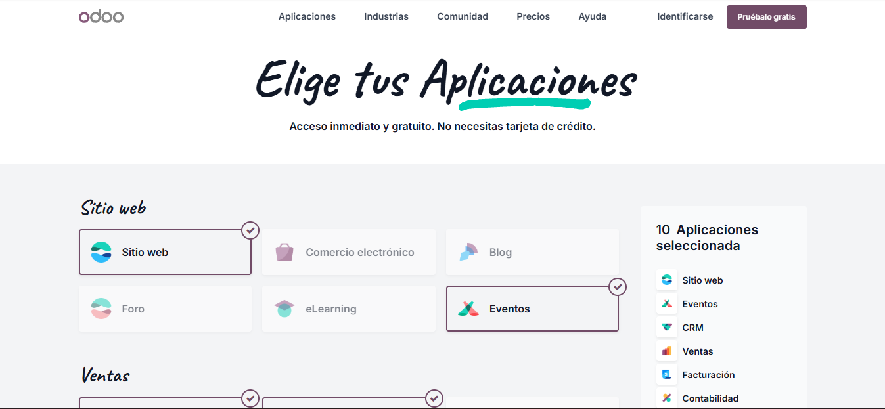
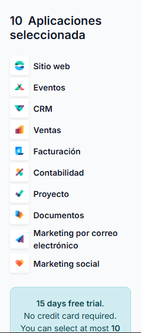
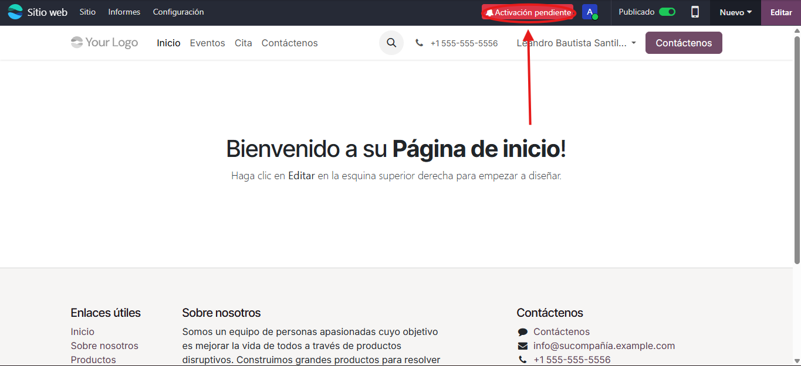
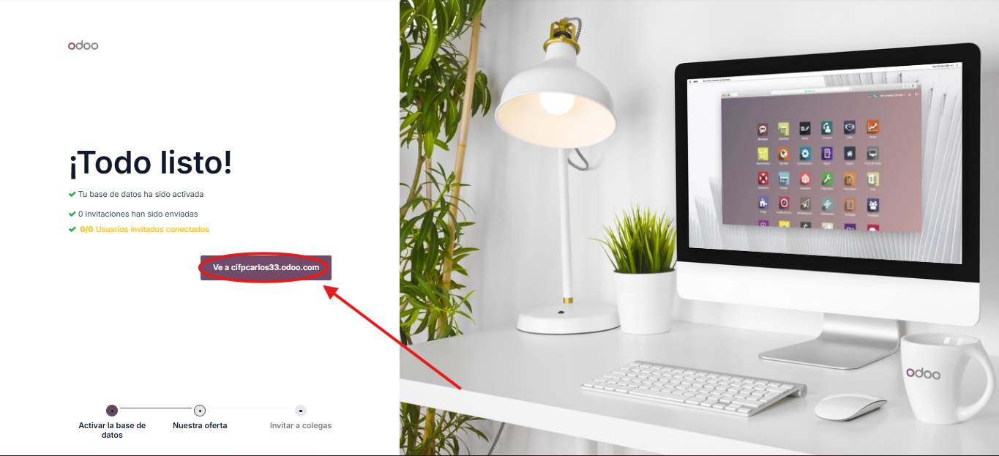
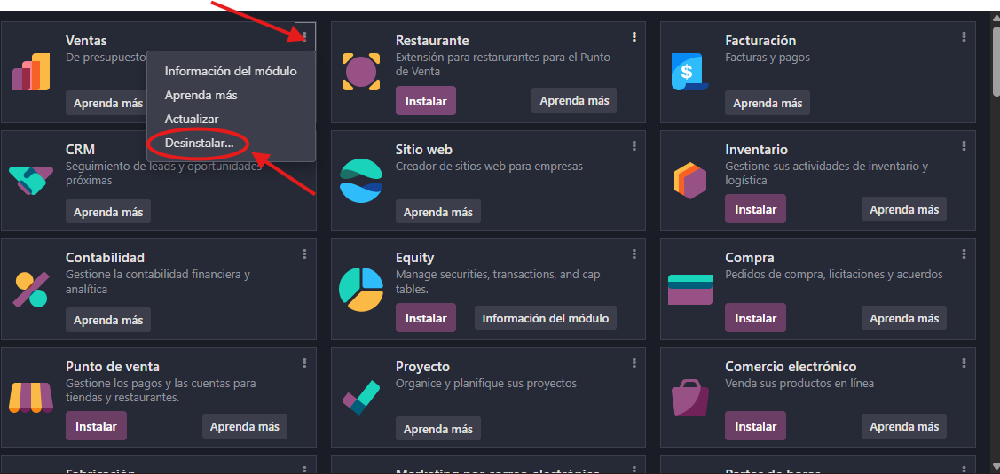

# 03 — Instalación y prueba (15 días) / Alta e instalación de apps

**Objetivo:** Crear una base de datos de prueba gratuita en Odoo y aprender a instalar o desinstalar aplicaciones.

## Requisitos previos

Para iniciar el proceso de prueba de Odoo se recomienda tener en cuenta los siguientes elementos:

- **Navegador actualizado**
- **Cuenta de correo electrónico** para activar la prueba gratuita

## Pasos

### Crear base de datos de prueba (15 días)

Para obtener acceso gratuito a Odoo durante 15 días:

1. Visita 👉 [https://www.odoo.com](https://www.odoo.com)  
2. Selecciona la opción “Empiece ahora”

3. Elige tus Aplicaciones (Un máximo de 10)

4. Completa los datos solicitados (nombre, correo, contraseña, país, etc.)

### Activación por correo electrónico
Tras registrar tus datos, Odoo enviará un mensaje de confirmación

**Debes activar la cuenta en un plazo de 3 horas siguientes**, o la base de datos se eliminará automáticamente

Una vez confirmada la activación y establecida la contraseña, tendrás **acceso completo por 15 días** a la versión Enterprise

La prueba gratuita dura 15 días e incluye acceso completo a la versión Enterprise, con todas las funcionalidades activas

---

### Instalar o desinstalar aplicaciones

Una vez dentro de la plataforma, el **panel principal** mostrará todas las aplicaciones instaladas

Para gestionar módulos, sigue estos pasos:

### Instalar
- En el menú lateral, selecciona **Aplicaciones**

- Busca el módulo que quieras instalar  
- Presiona **Instalar**

### Desinstalar

En la app que deseas eliminar, haz clic en los tres puntos y selecciona Desinstalar

**Aviso**: Al desinstalar un módulo, se eliminan también los datos asociados. Odoo muestra una advertencia antes de desinstalar módulos críticos. Es importante leerla con atención

## Resultado esperado

Tras completar el proceso de alta, activación y selección de aplicaciones, obtendrás:

- **Acceso al panel principal** de Odoo con las apps seleccionadas.  
- **Módulos activos** visibles en la interfaz principal.  
- **Confirmación de periodo de prueba:** 14–15 días de acceso gratuito.  
- **Entorno web funcional** para explorar todas las características de Odoo Enterprise
