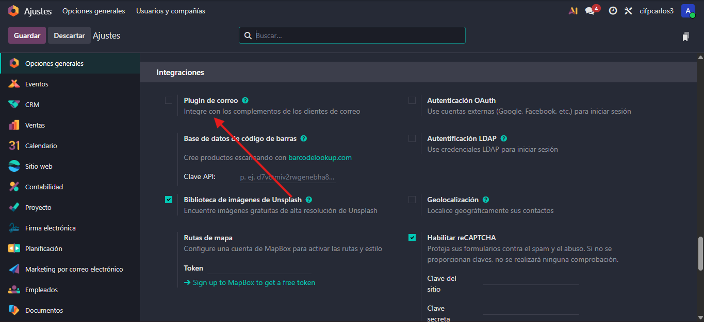
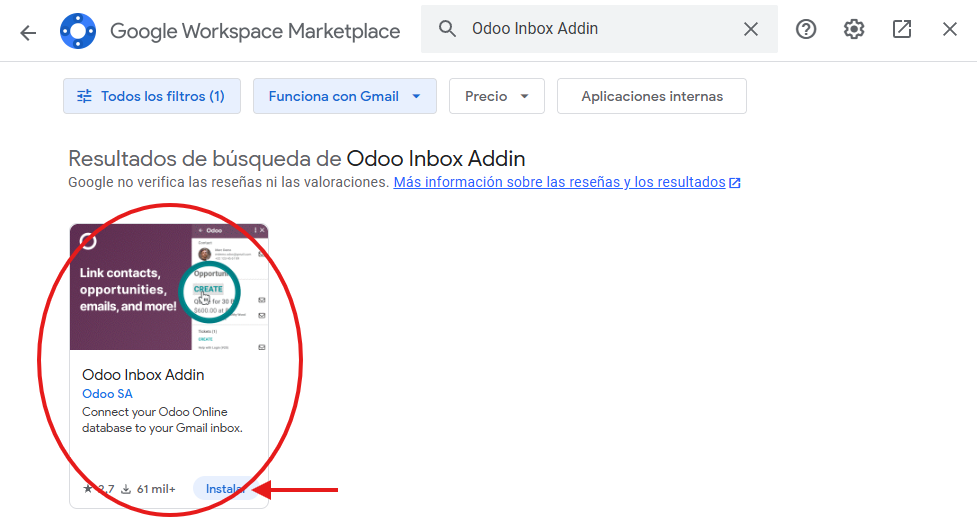

# 05 — Integración con Gmail (OAuth GCP + Add-on)

La vinculación de **Odoo con Gmail** permite que los correos electrónicos se integren directamente con los módulos de Odoo
## Requisitos

Para poder llevar a cabo esta integración, es necesario contar con:

- **Cuenta de Google Cloud**

## Pasos Detallados

La integración de Gmail con Odoo se realiza en **dos etapas principales**:

- Activando el add-on en Gmail para la funcionalidad inmediata 

- Configurando la autenticación en Google Cloud Console para la vinculación de servidores

### Activar plugin de correo en Odoo e instalar Odoo Inbox Add-on en Gmail

#### Activación en Odoo
1. Dirígete a **Ajustes**, **Opciones Generales**
2. En la sección de **Integraciones**, busca la opción **“Plugin de correo”** y asegúrate de que esté activada
3. **Guarda los ajustes** después de activarlo para que Odoo lo reconozca

#### Instalación del Add-on en Gmail
1. Ve a tu **bandeja de Gmail**
2. Haz clic en el botón “+” (Instalar complementos) en la barra lateral derecha
3. Busca la aplicación **“Odoo Inbox Addin”**, instálala

4. Concede los permisos necesarios para que el complemento pueda acceder a tu correo electrónico
5. Una vez instalado, el complemento de Odoo aparecerá en la barra lateral y te pedirá **iniciar sesión**

### Configuración en Google Cloud Console

Para permitir que Odoo acceda a tu cuenta de Google de forma segura, debes configurar un proyecto **OAuth** en la **Consola de Google Cloud**

Dentro de ajustes accede a proveedores OAuth, despúes de habilitarlo, selecciona google OAuth y marca "permitido"

#### Creación del Proyecto
- Accede a [Google Cloud Console](https://console.cloud.google.com/) 
- Crea un nuevo proyecto

#### Crear Credenciales (OAuth)
1. Dirígete a **Credenciales, Crear Credenciales**
2. Elige la opción **Datos del usuario** y haz clic en **Siguiente** 
3. Asigna un nombre a la aplicación y proporciona un correo electrónico de asistencia
4. En la sección **Permisos**, agrega los permisos necesarios, incluyendo aquellos que permitan a Odoo **leer, redactar y enviar correos electrónicos** en tu nombre
5. Selecciona el **Tipo de Aplicación, Aplicación Web**

#### Configurar URI de Redireccionamiento
Es crucial añadir la URL de redireccionamiento autorizada para la comunicación entre Gmail y Odoo

### Copiar Client ID / Secret a Odoo

Una vez finalizada la configuración en GCP, obtendrás el **ID del cliente (Client ID)** y el **Secreto del cliente (Client Secret)**, que se deben ingresar en Odoo

#### 1. Obtener Credenciales
- Vuelve a **GCP, Credenciales**
- Localiza el proyecto y copia los valores de **Client ID** y **Client Secret**

#### 2. Configurar en Odoo
1. En Odoo, dirígete a **Ajustes, Integraciones, Autenticación OAuth** 
2. Dentro de **Proveedores OAuth**, selecciona **Google** 
3. Pega el **Client ID** y el **Client Secret** obtenidos de GCP en los campos correspondientes
4. Guarda los cambios

#### 3. Configuración del Servidor de Correo
1. En Odoo, ve a **Ajustes, Correos Electrónicos**
2. Habilita la opción **“Utilizar servicios de correo electrónico personalizados”**
3. Una vez habilitada, selecciona **“Usar un servidor de Gmail”** 
4. Introduce nuevamente el **Client ID** y el **Client Secret**  
5. Guarda todos los cambios

### Probar desde Gmail

Con el complemento instalado y la autenticación configurada, la integración ya está lista para su uso

1. Abre cualquier correo electrónico en Gmail.  
2. Haz clic en el **Add-on de Odoo** en la barra lateral.  
3. Odoo intentará **identificar automáticamente el remitente y la empresa**
4. Desde el complemento podrás:  
   - Crear un nuevo **contacto** 
   - Crear una **oportunidad comercial** en el módulo **CRM** de Odoo, vinculándolo directamente con ese correo electrónico