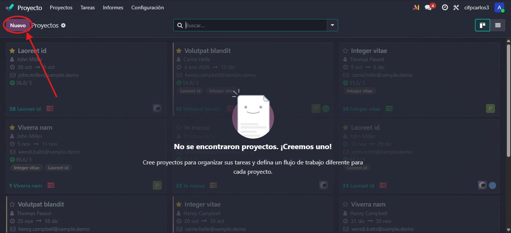
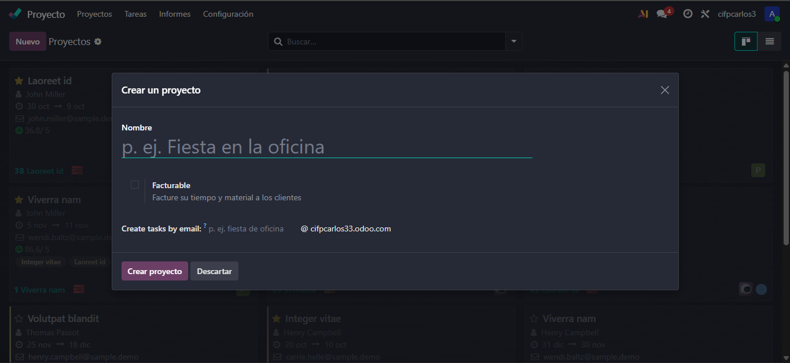
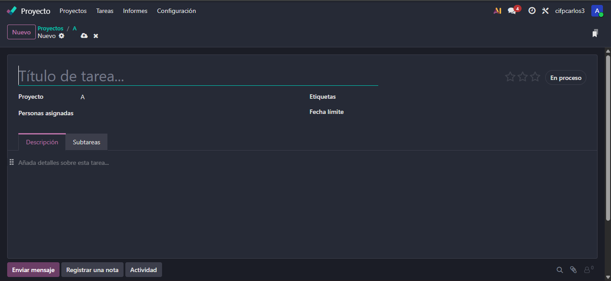
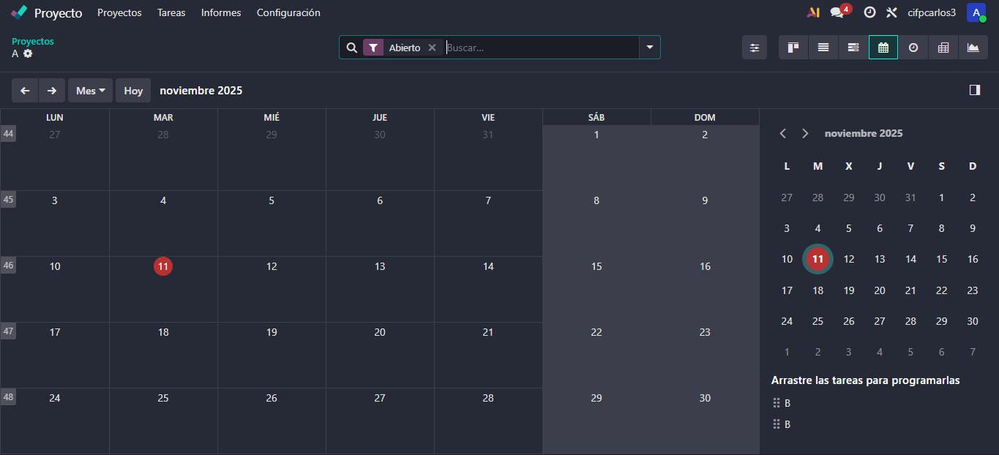
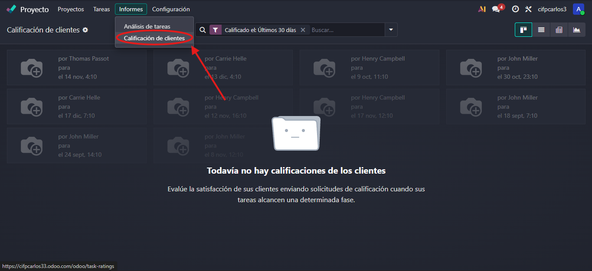

# 08 — Proyectos (Kanban)

El módulo de **Proyectos** es una de las aplicaciones clave en Odoo.
Este módulo se debe instalar al configurar Odoo inicialmente

## Proyectos, etapas, tareas y subtareas

La estructura del módulo de Proyectos se basa en una jerarquía clara:

- **Creación del Proyecto:** Al crear un proyecto, se asigna un nombre

  También se puede definir si el proyecto será **facturable**
  
  
- **Etapas:** Odoo sugiere fases predeterminadas, pero se pueden crear tantas etapas como sea necesario
  - **Vista de Etapas Agrupadas:** Permite categorizar las etapas por estado
- **Tareas:** Las tareas se crean dentro de cada etapa. Se puede asignar a una persona, establecer prioridad y definir fecha límite
- **Subtareas:** Permite jerarquizar tareas dentro de otras tareas principales
  - La tarea principal muestra un resumen de las subtareas realizadas

## Tareas recurrentes, dependencias y hitos

Odoo permite funcionalidades avanzadas para una gestión más sofisticada del flujo de trabajo:

- **Tareas recurrentes:** Se configuran en los ajustes del módulo para repetición semanal, mensual o anual
- **Dependencias de tareas ("Bloqueado por")**: Una tarea puede estar bloqueada hasta que se completen otras tareas. Las tareas bloqueadas se muestran con la etiqueta "En espera"
- **Hitos (Milestones):** Permiten marcar logros importantes dentro del proyecto

## Vistas: tarjetas, lista y calendario propio

El módulo de Proyectos ofrece varias formas de visualizar el trabajo:

- **Vista de Tarjetas:** Similar a Trello o Asana, permite arrastrar y soltar tareas entre etapas.  
- **Vista de Listado:** Muestra las tareas en una lista y permite añadir campos visibles como etiquetas, cliente, prioridad y fecha límite.  
- **Vista de Calendario (del módulo):** Permite un control visual de:
  - Tareas recurrentes
  - Tareas pendientes o atrasadas.
  - Visualización del equipo (tareas de otros empleados)
  - Se diferencia del Calendario general, que se usa más para citas, llamadas y reuniones

## Registro rápido de actividades y calificación del cliente

Odoo facilita la trazabilidad y comunicación con herramientas rápidas de registro y feedback:

- **Registro rápido de actividades:** Cada tarea tiene un icono de reloj para programar actividades. Permite:
  - Registrar notas sobre llamadas o correos
  - Agendar reuniones o llamadas pendientes
  - Mantener un historial de la tarea sin necesidad de editarla 
- **Calificación del cliente (Analítica):** Activable en ajustes, permite que el cliente califique la entrega y la calidad del servicio al finalizar el proyecto
  - Este feedback es valioso para mejorar la gestión de tiempos y la calidad del servicio

