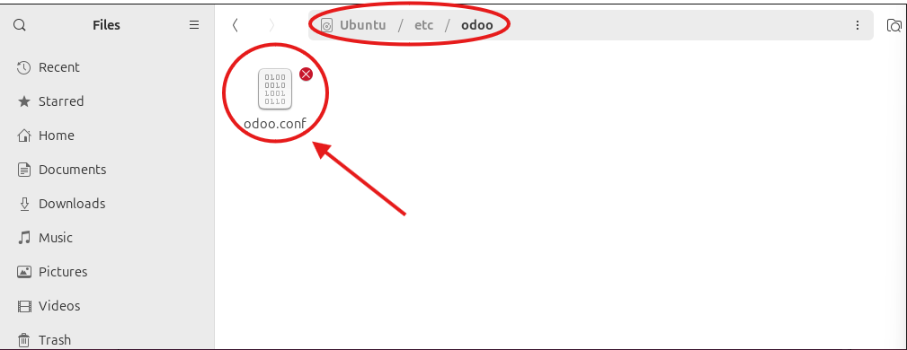

# 07 — Configuración de Odoo (`/etc/odoo/odoo.conf`)

1. Crea/edita el archivo de configuración con:
   ```ini
   [options]
   db_host = False
   db_port = False
   db_user = odoo
   db_password = False
   addons_path = /opt/odoo/odoo-src/addons
   logfile = /var/log/odoo/odoo.log
   xmlrpc_port = 8069
   ```
   
2. Crea carpetas y permisos si procede:
   ```bash
   sudo mkdir -p /var/log/odoo && sudo chown odoo:odoo /var/log/odoo
   ```

> Resultado esperado: configuración mínima funcional creada.
